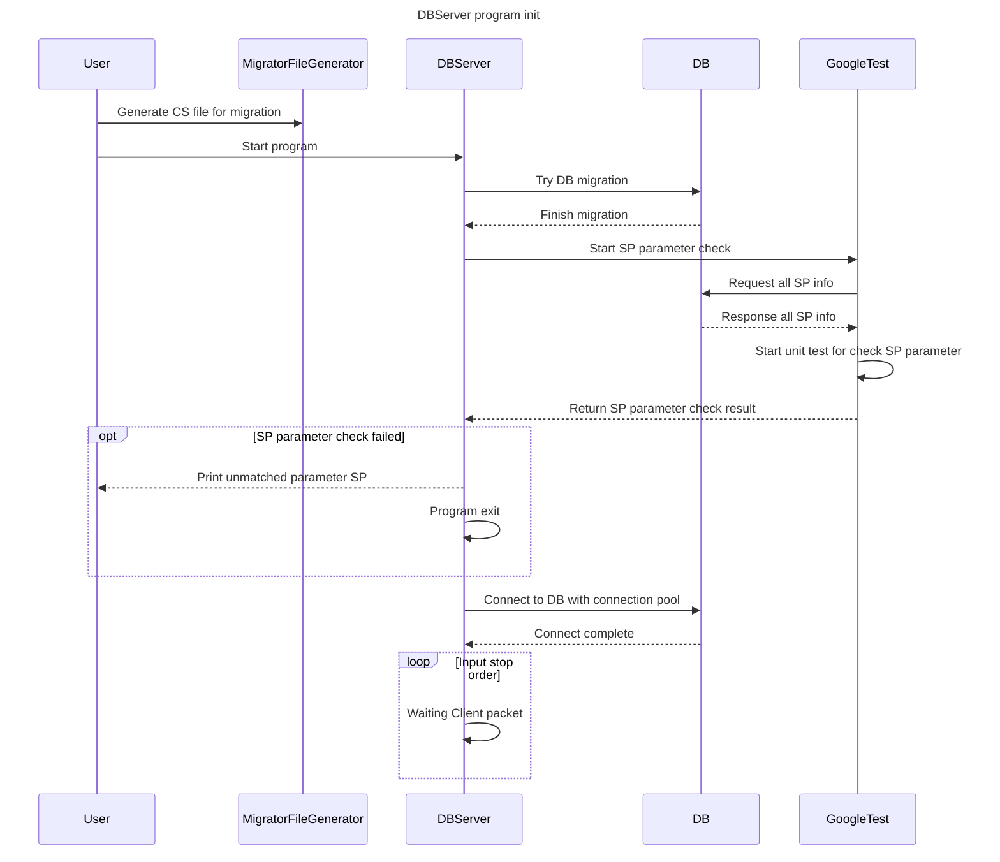
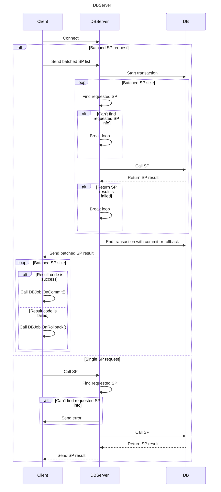

# DBConnector

## 제작 기간 : 2023.04.21 ~ 2023.07.04

1. 개요
2. 프로시저 등록 방법
3. 마이그레이션
4. 주요 클래스

---

1. 개요

ODBC를 사용한 MSSQL용 DBConnector 입니다.  
써 놓기는 MSSQL용이지만, 조금씩만 변경하면 MySQL에서도 사용 가능하며, 그 외에는 테스트를 진행해보지 못했습니다.

이전에 제작했던 DBConnector의 경우, DBSendQuery()를 사용하여 실제 쿼리문을 프로그램 내에서 제작하여 DB에 송신하는 방법으로 사용하였습니다.  
이 방법 대신, 사용자의 실수를 줄이도록 DB에서 정의한 Stored Procedure만을 사용하도록 하며, 

각 프로시저가 사용자가 정의한 실제 프로시저와 같은 Input과 Output을 사용하는지를 Google Test를 사용하여 검사하며, 정상적인 프로시저의 사용만을 유도합니다.  
BuildConfig.h의 UNIT_TEST를 0으로 수정하여 Google Test를 Off시킬 수 있지만, 이 경우, DB와 프로젝트 내에서 사용자가 정의한 프로시저의 상호 검증 과정이 제외되므로, 권장하지 않습니다.

현재 테스트를 위하여 DBServer를 추가하여 [RIOTest의 DBClient](https://github.com/m5623skhj/RIOServerTest/blob/main/RIO_Test/DBClient.cpp)와 통신하며, 클라이언트가 요청한 프로시저를 호출합니다.  
현재 프로젝트를 그대로 실행시킬 시, 시작 흐름은 아래와 같은 순서로 진행됩니다.

DBServer와 DB, Client 간의 통신은 아래와 같습니다.

---

2. 프로시저 등록 방법

모든 프로시저는 StoredProcedure.h에서 IStoredProcedure를 상속 받아서 정의합니다.

각 프로시저 클래스 내부에 DEFINE_CLASS_INFO()로 해당 패킷 클래스를 정의하고, 

REGISTER_PROPERTY()로 모든 파라미터들을 등록합니다.

생성자에서 모든 프로시저 파라미터들을 INPUT_REAL_POINTER()의 인자로 호출해줘야 정상적으로 프로시저에 값이 대입됩니다.

Google Test를 사용하기 위해서는, INPUT_TEST_PROCEDURE_MAP()에 해당 프로시저를 등록해줘야 합니다.

프로시저의 결과를 얻어오지 않는 경우, 	using ResultType = DB_IgnoreType만 선언해주면 되며,

결과가 있을 경우, ProcedureType.h에서 IResultType를 상속하여 정의합니다.

IResultType 상속 클래스도 INPUT_TEST_PROCEDURE_MAP()를 제외하고 IStoredProcedure와 같게 정의해주시면 됩니다.

---

3. 마이그레이션

[FluentMigrator](https://fluentmigrator.github.io/)를 이용하여 DB 마이그레이션을 진행합니다.

마이그레이션 파일을 만드는 방법은, [DBMigration 폴더](https://github.com/m5623skhj/DBMigrator/tree/main/Migrator/DBMigration)에 sql 파일을 정의한 후, MakeCSFile.py를 실행하면 

cs 파일이 생성되며, Migrator.csproj 파일에 해당 파일을 사용한다는 변경 사항이 추가됩니다.

이후 Migrator.exe를 직접 실행하거나, 이 프로젝트를 실행하여, 마이그레이션을 진행합니다.

프로젝트 실행으로 마이그레이션을 실행한다면, [Path.h](https://github.com/m5623skhj/DBConnector/blob/master/DBConnector/Path.h)의 경로를 확인해주세요.

---

4. 주요 클래스

* DBConnector
  * DBConnectionPool과 연결 정보들을 관리
  * 기본적으로 defaultConnection을 지니고 있으며, 설정 파일에 정의된 ConnectionPoolSize 만큼 커넥션 풀을 관리

* DBConnectionPool
  * Connection을 관리
  * 연관된 스레드의 갯수 만큼 만드는 것을 권장
 
* ODBCMetaData
  * 사용자가 정의한 프로시저들의 메타데이터를 관리
  * 실제 DB에서 SP 이름, Input column, Output column 들의 메타데이터를 map으로 가져와서 관리

* BatchedDBJob
  * UPSERT 전용 SP 호출 구조체
  * 클라이언트에서 요청한 갯수 만큼의 SP를 트랜잭션으로 묶어서 호출
  * 전체 COMMIT이 성공해야만 DB에 COMMIT 시키며, 하나를 실패하는 즉시, 같이 실행된 모든 SP를 ROLLBACK시킴

---

참고

https://www.slideshare.net/xtozero/c20-251161090

https://fluentmigrator.github.io/
